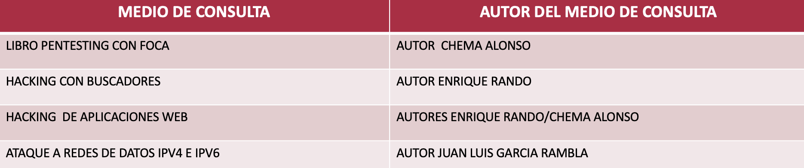
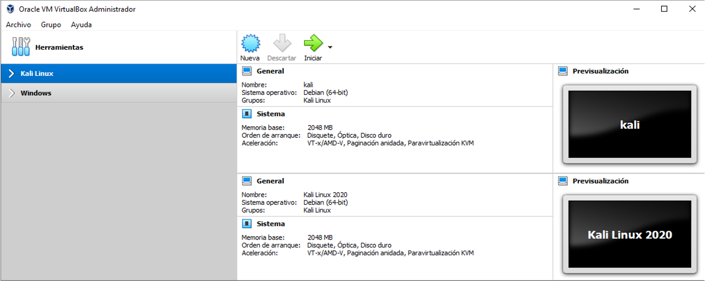

# Modulo 1 

* Bienvenida 
* Aspectos importantes
* Conceptos basicos 
* Virtual Box y maquinas virtuales
* Conocimientos Virtual Box 
* Guest Aditions 
* Descargar e instalar Virtual Box

# Introduccion
El objetivo del curso es poder proveeder a los participantes de las tecnicas y procedimientos del Hacking Ethical 

 ## Que es un Hacker etico? 

Persona que posee conocimientos bastos en informatica, y cuyo trabajo es detectar fallos de seguridad en sistemas informaticos 

## Diferentes tipos de hackers
 1. Balack hat (Sombrero negro)

Acceden  a sistemas o redes informaticos de manera no autorizada con la finalidad de causar danio

 2.  Grey hat (Sombrero gris)

Su estica depende del momento, prestan sus servicios a empresas, o entidades de gobierno y divulgan info sensible a cambio de dinero

 3.  White hat (Sombrero blanco)

Se dedican a la investigacion y notificacion de vulnerabilidades en sistemas informaticos. Se los conoce como **Hackers eticos**

## Aspectos importantes
Medios de consulta externa: 

## Conceptos basicos 
* Navegacion anónima

Es la posibilidad de acceder a sitios en Internet sin que se pueda identificar a la persona o dispositivo que está accediendo a los servicios que se conecta (webmail, páginas, etc.), no nos referimos a la privacidad en general, sino a la parte de identificación.

* Hacktivismo

la utilización no-violenta de herramientas digitales persiguiendo fines políticos; estas herramientas incluyen desfiguraciones de webs, redirecciones

* Script kiddie

Script Kiddie, en español, niño de guion, es un anglicismo propio de la jerga de Internet que hace alusión a una persona falta de habilidades técnicas, sociabilidad o madurez. Considerada un incompetente en una materia actividad específica o dentro de una comunidad

* Sniffer

En informática, un Sniffer es un programa de captura de las tramas de una red de computadoras. Es algo común que, por topología de red y necesidad material, el medio de transmisión sea compartido

* Malware

Se llama malware, del inglés malicious software, programa malicioso, a cualquier tipo de software que realiza acciones dañinas en un sistema informático de forma intencionada y sin el conocimiento del usuario.

* Ingeniería social

La Ingeniería social es la práctica de obtener información confidencial a través de la manipulación de usuarios legítimos, la información que se busca obtener generalmente es de carácter confidencial

* Phishing

Phishing es un término informático que denomina a un conjunto de técnicas que persiguen el engaño a una víctima ganándose su confianza haciéndose pasar por una persona, empresa o servicio de confianza, para manipularla y hacer que realice acciones que no debería realizar

* Tecnicas de ataque cibernetico
  
Existen muchas técnicas para realizar ataques cibernéticos, sin embargo a manera de conocimiento  general mencionaremos algunas de estas, en temas posteriores estaremos profundizando más en sus conceptos y utilización.

Para realizar un ataque cibernético un hacker se puede valer de:

1. Creacion de payloads
2. Uso de exploits
3. Explotación de vulnerabilidades
4. Ataque de fuerza bruta
5. Ataques de Cracking
6. Denegación de servicios (simple / distribuida)
7. Phishing

## Conocimientos Virtual Box 

¿Qué es virtual box?

Virtual box es sin duda una de las mejores alternativas gratuitas de virtualización.
Es un software que permite crear diversas maquinas virtuales

https://www.virtualbox.org/

## Virtual Box y maquinas virtuales

### ¿Qué es una máquina virtual?

Una maquina virtual se gestiona a través de un software que simula ser una computadora, además de ser capaz de ejecutar programas de forma independiente como si fuera una computadora real

### Entorno de  virtual box

### Nomenclaturas de virtual box

Dentro de los entornos virtuales existen dos tipos de equipo

* Equipo anfitrión

El  equipo anfitrión es aquel que suministra los recursos a los equipos virtuales para que estos puedan operar correctamente.

* Equipo huesped

Una máquina virtual se llama equipo huésped porque al iniciar toma recursos prestados desde el equipo anfitrión para que pueda funcionar

Características de un equipo huésped:

1. Una característica del equipo huésped (equipo virtual) es que nunca podrá exceder la capacidad o recursos que le son prestados por el equipo físico.
2. Debemos ser cuidadosos al asignar recursos desde  el equipo físico hacia el equipo huésped, ya que mientras la maquina virtual este en funcionamiento estos recursos dejarán de estar presentes en el equipo físico.

**Si se otorga un porcentaje elevado de recursos al equipo huésped, existe el riesgo de que el anfitrión colapse y no sea capaz de iniciar su propio sistema operativo.**

# Guest Aditions 

### ¿Qué son las guest additions?

Se trata de un paquete de software especial, el cual es un complemento indispensable para obtener el máximo provecho de esta popular herramienta de virtualización.

El paquete debe instalarse de forma independiente en cada máquina virtual.

Las guest additions proveen mejoras notables a los sistemas virtualizados.

Las guest additions también se conocen como “aplicaciones del huésped”

Veamos algunas de las mejoras que provee este paquete de software:

*  Integración del cursor del raton

Esto implica que podemos mover el ratón libremente entre la máquina virtual y la real sin necesidad de pulsar ninguna tecla para capturarlo/liberarlo. Hace que sea mucho más cómodo el usar la máquina virtual

* Mejora en el soporte del video

El driver de vídeo que se instala con las Guest Additions nos ofrece no sólo una buena aceleración de vídeo, sino también resoluciones más altas.

* Sincronía en la zona horaria

Gracias a las guest additions, Virtual Box se asegura de que la hora del sistema virtualizado esté mejor sincronizada de forma correcta, de acuerdo a la ciudad y país donde está instalado el sistema huésped.

* Uso de carpetas compartidas

Una de las características más importantes es la de las carpetas compartidas porque es una forma fácil de poder intercambiar archivos entre el sistema real y el virtualizado.

* Uso de portapapeles bidireccional

Al igual que las carpetas compartidas el poder compartir el portapapeles es de gran utilidad. Gracias a esta característica podemos copiar y pegar independientemente de que estemos en la máquina virtual o real.

# Descargar e instalar Virtual Box

## Arquitectura del anfitrion
Para conocer la arquitectura del equipo anfitrion bastara con acceder  las propiedades del equipo y la info correspondiente se mostrara en pantalla 

