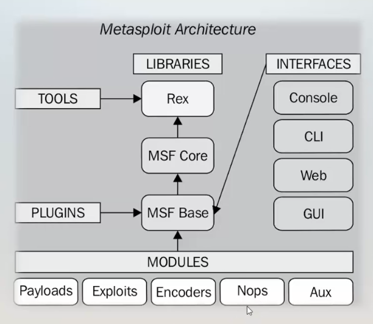

# Modulo 10 - Metasploit

## Ques es Metasploit?
Es un proyecto de codigo abierto para la seguridad informatica, que proporciona info acerca de vuonerabilidades de seguridad y ayuda en test de penetrafion "Pentesting" y el desarrollo de firmas para sistemas de deteccion de intrusos

## Estructura de Metasoploit

## Componentes de Metasploit
1. Auxiliares: son modulos que permiten recopilar info previa al ataque. 
   * Ejemplo: Escanear objetivos, detectar servicios, efectuar enumeracion, realizar ataques de claves, etc   
3. Exploits: abren la brecha en el equipo victima, explotan vulnerabilidades en sitemas remotos 
   
4. Encoders: permite evadir la seguridad del equipo victima, producen codificadores para ofuscar el codigo de las shellcodes y de este modo evitat que los sistemas antivirus puedan detectar el payload.
   
5. Payloads: son los que llevan el exploit al equipo victima. Son fragemtos de software que tiene el fin de aprovechar una vulnerabilidad en un sitema.

   * Son la parte del malware que realizan una accion maliciosa.
   
6. Post: son los modulos de post-explotacion, permiten ejecutar acciones/tareas sobre un sistema ya comprometido. 
   * Ejemplo: la elevacion de privilegios 
   
7. Nops: son modulos no operacionales, le dan estabilidad al ataque 

## Paso a paso
1. Levantar los servicios con el comando 
   * service postgresql start && msfdb init && msfconsole -q

