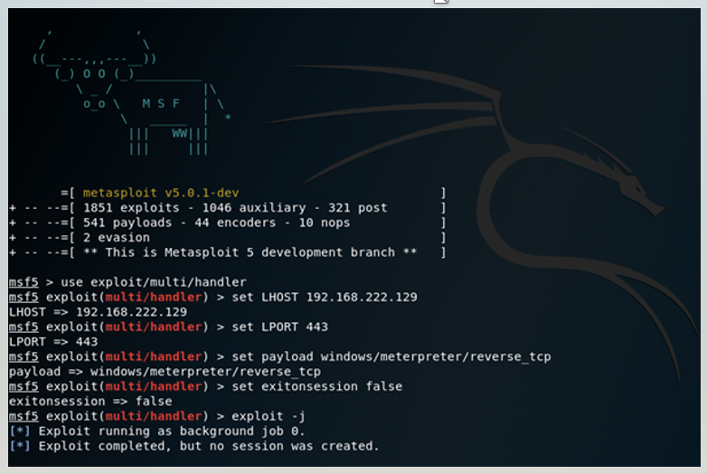

# Obteniendo meterpreter
### ¿Qué es meterpreter?

Meterpreter es un programa malicioso de tipo troyano que permite a los ciberdelincuentes controlar de forma remota las computadoras infectadas. Este malware se ejecuta en la memoria de la computadora sin escribir nada en el disco.

### ¿Qué es un handler?
Un handler es un “escuchador” y es lo que se utiliza para poder crear la conexión con un payload, o iniciar una conexión hacia un host  en un puerto especifico.

Por lo general el mas utilizado en Kali Linux es el multi/handler

**Un ejemplo de multi handler**

Así es como se aprecia un multi handler configurado:

### Obtención de meterpreter
Existen diversas formas de obtener una sesión de meterpreter veamos algunos ejemplos:

* Ofuscamiento de un ejecutable
* Bindeo de un payload
* Creación de un payload con falsificación de permisos
* Ejecución de un .apk (aplica para Android)

