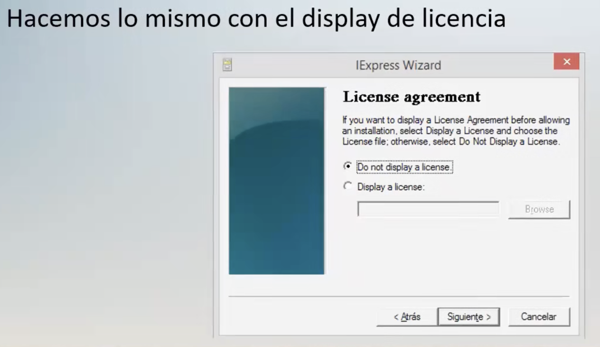

# Bindeo de Payload
## Definicion de bindeo
Es el procedimiento de ocultacion de una app maliciosa detras de una app inofensiva

* Por ejemplo: Ocultar un bacdoor detrs del instalador de winrar

## Consideraciones importantes
- Un payload con extension .exe puede ser bindeado para diversas arquitecturas
- Se recomienda utilizar programas que tomen cierto tiempo en instalarse
- Es importante verficar que el backdoor no sea detectado por los antivirus
- Realizar un buen trabaji de ing. social para que ;a victima ejecute el archivo

## Herramientas de Binedeo
Que es el IExpress? IExpres usa un archivo de directivas autoextraibles 

Cuando ejecuta el Asistente para IExpress, puede comenzar para un archivo exitente o crear uno nuevo mediante el asistente 

## Procedimiento de Biendeo 
Usaremos un payloads con el nombre `payload.exe` el cual se creo en linux y vamos a proceder a ocultarlo detras de un software llamado `osfmount`

El software que usaremos como contenedor es una herramienta que se utiliza para montar imagenes .iso en windows

