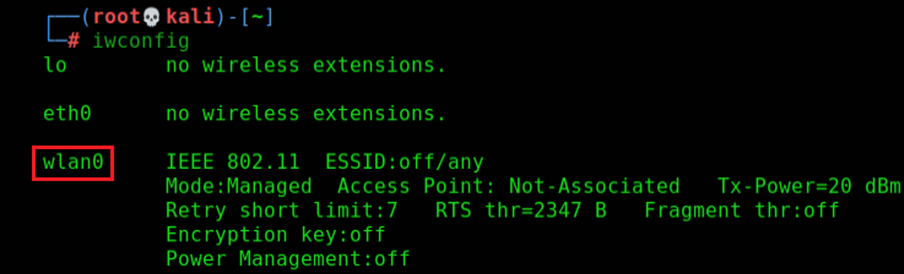
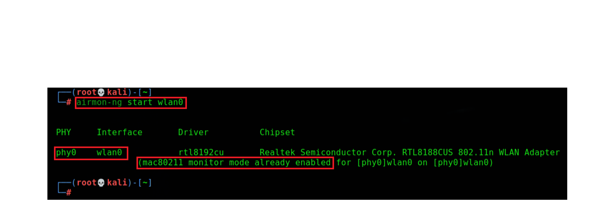

# Ataque a redes inalambricas 

## Intro a redes WIFI
### Que son las redes WIFI?
`WIFI`, es una herramienta de red inalambrica a traves de la cual los dispositivos como computadoras, telefonos, y otros equipos pueden interactuar con internet
### Ventajas de una red WIFI
Fácil instalación: La instalación de una red inalámbrica es más rápida y sencilla que la de una red por cable. También reduce el uso de cables, que son difíciles de instalar y suponen un riesgo de seguridad. Mayor cobertura: Las redes inalámbricas tienen un mayor alcance que las redes por cable.

### Populareidad de las redes WIFI
El uso de este tipo de red se está convirtiendo cada vez en algo más común, no solo en los entornos domésticos y profesionales, sino también en lugares públicos (bares, cafeterías, centros comerciales, librerías, aeropuertos, etcétera) y en instituciones académicas.

### Protocolos de comunicacion 
Wi-Fi es un conjunto de especificaciones para las redes de área local inalámbricas (WLAN), basadas en el estándar IEEE 802.11.
Con la tecnología Wi-Fi, es posible implementar redes que conectan ordenadores y otros dispositivos (smartphones, tablets, consolas de videojuegos, impresoras, etcétera) que están próximos geográficamente.

### Redes WIFI y los modelos OSI
El protocolo IEEE 802.11 o WI-FI es un estándar de protocolo de comunicaciones de la IEEE que define el uso de los dos niveles más bajos de la arquitectura OSI (capas física y de enlace de datos), especificando sus normas de funcionamiento en una WLAN. 

### Tipos de cifrado de redes WIFI
Existen diversos cifrados para la redes wifi, entre los mas comunes podemos mencionar:
- WEP
- WPA
- WPA 2
- WPS

## Clasificacion de antenas WIFI
### Antenas para wifi hacking 
Existen diversos tipos de antenas que permiten realizar auditoria de redes wifi, sin embargo también existen marcadas diferencias entre los diversos fabricantes de estas.
- TP-LINJ
- ALFA NETWORK

### El chipset Realtek
El chipset cumple la función de transmitir y recibir algoritmos de seguridad, entre los que este soporta podemos mencionar los siguientes:
- Wep
- Wpa
- Wpa-2
- wpa.-psk

### Alcance de las tarjetas wifi
Entre la gama que existe de antenas wifi podemos encontrar desde antenas muy básicas que pueden llegar a dar un alcance de entre 20 a 50 metros de distancia hasta antenas que pueden llegar a ofrecer 50 km de distancia.

Cabe señalar que una antena que ofrezca un alcance de 50 km dependerá de las condiciones geográficas (visibilidad entre el punto A y el punto B)

### Antenas rompe muros 
Una antena rompe muros es lo que necesitas para acceder a los lugares más lejanos a tu emisor de internet, ampliando la señal y estabilizándola, aunque se atraviesen paredes o techos, reduce la interferencia causada. 

### Antenas externas 
Uno de los fabricantes de mayor prestigio en el sector de antenas para wifi es sin duda Alfa Network, esta marca  ofrece una diversidad de antenas y uno de sus productos mas destacado es la antena ALFA UBD0
- Transmisión de WiFi hasta 2km
- Diseñado para uso en exteriores, caja estanca resistente al agua y la humedad.
- Alta calidad y Tecnología Alfa Network
- Cable de 8 metros USB

### El modo minitor 
El modo monitor es el modo de captura de datos que permite hacer uso de la tarjeta WiFi en modo escucha o modo promiscuo. En este modo la tarjeta es capaz de capturar todos los tipos de paquetes WiFi.

Lo primero y más sencillo es saber el chipset exacto que utiliza la tarjeta de red Wi-Fi. De esta forma, solo tendremos que ir a Google y buscar información detallada sobre ese modelo y saber si acepta o no modo monitor e inyección de paquetes.

Existen diversas formas de habilitar el modo monitor (promiscuo) de una tarjeta de red, si al activarlo se muestra la leyenda “PHY0” significa que la tarjeta es capaz de inyectar trafico por lo que podrá utilizarse para wifi hacking.

### Validacion de la terjeta de red 
Inicialmente se observa que la tarjeta de red inalámbrica es compatible con el sistema Kali Linux

### Colocacion en modo monitor
Para colocar la tarjeta en modo monitor debemos identificar el nombre de la interface que en este caso es “wlan0”

### Comandos utilizados 
| COMANDO UTILIZADO         | FUNCION QUE SE EJECUTA                 |
|---------------------------|----------------------------------------|
| `Airmon-ng start wlan0`   | Inicia la tarjeta en modo monitor     |
| `PHY0   WLAN0`            | Indica que la tarjeta puede inyectar tráfico |
| `Monitor mode already enabled` | El modo monitor está activado       |
