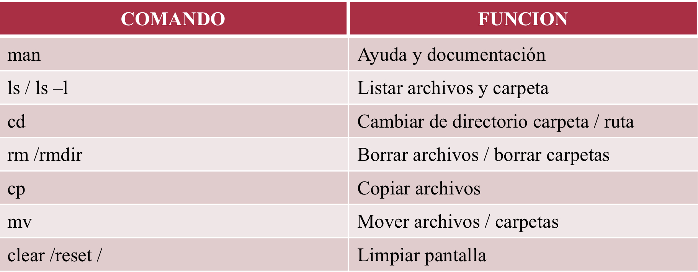
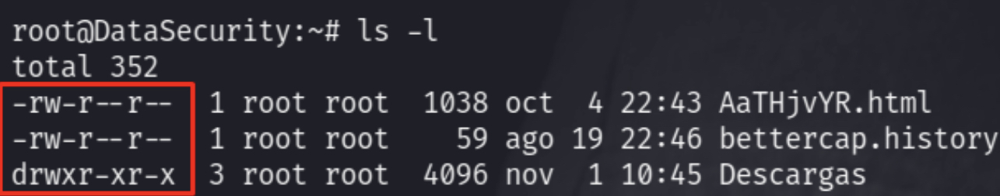
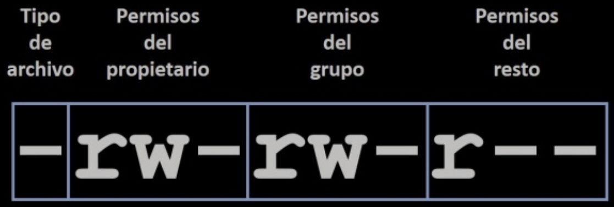
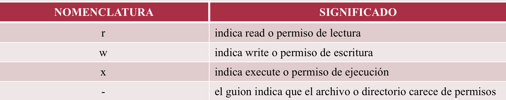

# Modulo 2
* Intro al Hacking etico
* Intro a Kali Linux
* Correo electronico temporal

# Intro a hacking etico
La seguridad de los sitemas se encargan de su proteccion tanto fisica como logica
* Seguridad fisica: protecion del hardware y de las unidades de almacenamiento de datos. Idica como actual ante situaciones de incendios, sabotajes, robos, etc.
  
* Seguridad logica: proteccion del software, de datos y progrmas. El primer filtro de la seguridad logica es el **Antivirus**

### Que es un antivirus?
Son progrmas cuyo objetivo es detectar y eliminar virus informaticos. Buscar, detectar, eliminar, bloquearlos, prevenir y desinfectar.

### Que son los vectores de ataque?
Es un metodo que utiliza una amenaza para atacar un sistema. Una vez determinado el objetivo a atacar son necesarias una serie de indagaciones previas para determinar cual es el vector de ataque adecuado.

**Ejemplos:** 
1. Documentos con macros maliciosas
2. Imagenes modificadas y cargadas con payloads
3. Ofuscamiento de archivos ejecutables
   
### Componentes fisicos de seguridad
* Uso de **Fortiswitch**
* Uso de **Firewall Fisicos**
* Uso de un **IDS Fisico**

# Introduccion a Kali Linux
Kali linux es la nueva generacion de la distribucion Linux BackTrack para realizar Auditorias de Seguridad y Pruebas de Penetracion. Kali Linux es una plataforma basada en **GNU/Linux Debian** y es una reconstruccion completa de BackTrack

### Caracteristicas de KL
* Se adhiere completamente a los estandares de desarrollo de Debian. 
* Se puso en funcionamiento toda una nueva infraestructura, todas las herramientas han sido revisadas y empaquetadas utilizando git para el cvs
* Mas de 300 herramientas orientadas a la pruebas de penetracion, ademas es un sitemas gratuito.
* Soporte para dispositivos inalambricos, varios lenguajes, paquetes y repositorios firmados con GPG

### Que es in GPG?
Es una clave de seguridad y su funcion es descifrar un archivo que ha sido protegido mediante un GNU Privacy Guard.

## Comandos basicos de consola

### Permisos en linux
Dentro de los sitemas Linux se maneja 2 tipos de cuentas:
1. Root(Cuenta Admi): Maximos permisos dentro del sistema
2. Normal: Permisos standard

**ls -l** (comando para acceder a la info de permisos)

### Nomenclatura de los permisos

# Correo electronico temporal
Un email temporal o desechable es una dirrecion de correo electronico que, a diferencia de servicios como Gmail, se genera sin registro y sin contrasenia.

Tiene una fecha de caducidad, esto significa que luego de un tiempo determinado el correo electronico dejara de existir
### Que es un correo electronico?
Es un servicio de red que permite a los usuarios enviar, y recibir mensajes mediante redes de comunicacion electronica
### Que es un cliente de correo electronico?
Es un progrma instalado de forma local en una compotadora que permite acceder a los correos recibidos, asi como enviarlos.
