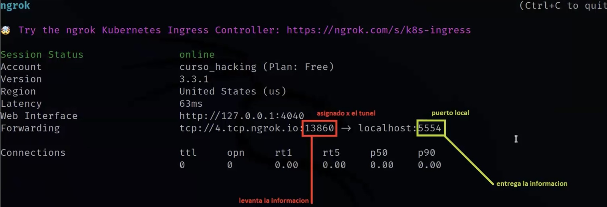

# Modulo 3
## Tunelizacion de protocolos
La tunerlizacion de protocolos consiste en encapsular(meter) un protocolo de red dentro de otro creando un tunel.

Este procedimiento se utiliza generalmete para transportar un protocolo determinado a traves de una red que en condiciones normales no lo admitiria.

Seria posible tunelizar trafico SHH a trave de trafico HTTP para ello se deberia redirigir mediente un tunel HTTP todo el trafico SSH

## SSH (Secure Shell)
**Es un protocolo de administración remota que le permite a los usuarios controlar y modificar sus servidores remotos a través de Internet a través de un mecanismo de autenticación**

## HTTP(Protocolo de Transferencia de Hipertexto)
Está basado en un sistema muy sencillo de comunicación que permite la transferencia de información en internet. Funciona con un esquema de petición - respuesta entre el usuario y el servidor.

## Servidores Proxy
Un servidor proxy es un sitema que funciona como punto intermedio entre el cliente y su destino.

Esto permit ocultar la dirrecion IP real del cliente ya que el destino final solo conocer la direccion  IP del servidor proxy.

**Principal funcion: "Es ser intermediario"**

Notebook -> Servidor Proxy -> Web

El concepto proxy se basa en redes de anonimizacion que basan su funcionamiento en el encadenamiento de proxis y en el uso de conexiones cifradas.

El uso principal que se le da a un servidor proxy es evitar la identificacion del cliente como origen de las pruebas, ademas de que el servidor proxy puede no almacenar ningun tipo de log.

### Encadenamiento de proxies
Es algo muy utilizado ya que resulta tedioso y complejo encontrar la conexion inicial, incluso podria utilizarse de forma geo-politica(china/USA)

## Que es una VPN?
Se trara de una tecnologia que permite crear conexiones entre 2 puntos valiendose de una red publica como internet

Usos principales:
* Evitar la interceptacion de trafico
* Se utilizan para conexiones seguras en sitios publicos
* Se usan para anonimizar conexiones mediante proveedores de VPN anonimos

## Pueros ngrok
