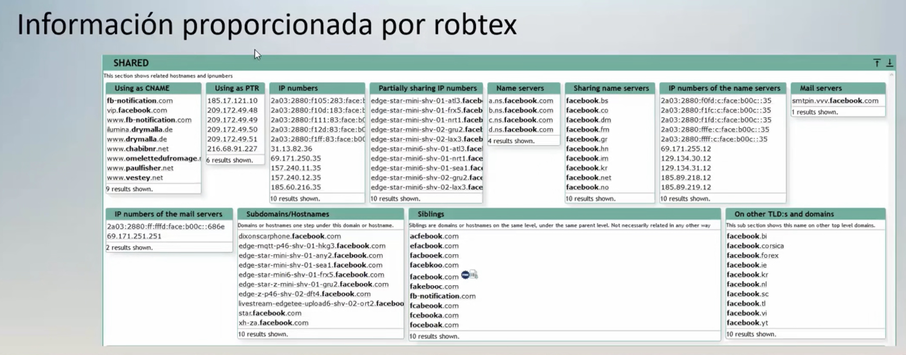

# Recopilacion de informacion
* Es el paso previo a hacer un ataque
* Tiene varios niveles
* De los pasos mas largos 

### Que es la recopilacion de info? 
El proceso de information gathering, tmb conocido como footprinting es una tecnica habitual que se aplica previamente a realizar la explotacion de un sistema informatico

### Comando Whois
WHOIS es un protocolo TCP basado en peticion/respuesta que se utiliza para efectuar consultas en una base de datos que permite determinar el propietario de un nombre de dominio o una direccion Ip de internet

**Comando**
* whois -h (TODO LO QUE SE PUEDE HACER)
* whois DOMINIO (data-security.com.mx)

Info que da:
* Creacion
* Expira
* Ultima actualizacion
* Registrante: 
   * Nombre
   * Ciudad
   * Estado 
   * Provincia

Informa quien es el propietario de un dominio wew, entre otras cosas.

# Analisis de direcciones IP
### Que es Robtex?
Es una app/sitio web que permite obtener de forma grafica info detallada ya sea de una direccion IP o de un dominio 

Se muestra de forma grafica 

* https://www.robtex.com/

El apartado "Shared" tenemos todos los nombre de host que pertenecen a facebook, asi como las dirraciones IP asociadas

# The harvester 
Una de las principales fuentes de información de las que un ingeniero social puede nutrirse para preparar sus ataques es –como no podría ser de otra forma– la página web de su víctima

**RECOPILA DATOS**

Comando:
* theHarvester

# Tecnicas de OSINT (Inteligencia de fuentes abiertas)

Son un conjunto de tecnicas y herramientas para recopilar info publica, correlacionar datos y procesarlos

Todo tipo de publicaciones pueden ser utilizdas para realizar recopilacion de info, desde una publicacion plasmada en un paoel hasta la info publicada en redes sociales 

### OSINT y redes sociales
La mayoria de las personas utilizan servicios de internet en los que almacenan fotos , asi como info relacionada a diversos temas 

### Herramientas de OSINT
* Redes sociales
* Herramientas en entornos Linux

### OSINT en linea
Para realizar tareas de OSINT en linea: 
* Busquedas por ubi
* Uso de palabras clave
* Datos laborales

