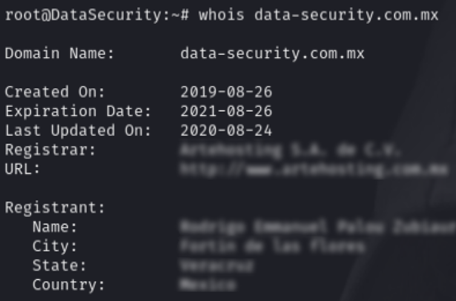
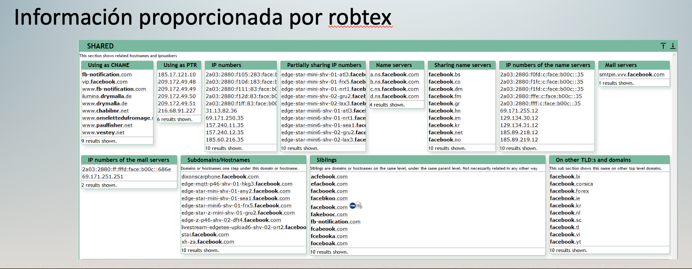

# Modulo 5 

## Recopilacion de informacion
### Que ses info Gathering?
El proceso de info gathering, tambien conocido como footprinting es una tecnica habitual que se aplica previamente a realizar la explotacion de un sistema informatico.

### Comando Whois
Es un protocolo TCP basado en peticion/respuesta que se utiliza para efecturar consultas en una base de datos que permite determinar el propietario de un nombre de dominio o una dirreccion IP en internet

**Que info provee?**

Como podemo ver el comando  WHOIS puede porveer info que resulete interesante para poder determinar quien es el propietario de un dominio web entre otros datos imporantes 

## Analisis de direcciones IP
### Que es Robtex?
Es una app web que permite obtener de forma grafica info muy detallada ya sea de una direccion IP o de un DOMINIO 

### Como se utiliza?
Al ingresar un demonio en el busxador obtendremos info detallada

Como podemos darnos cuenta el apartado "SHARED" tenemos todos los nombres de host que pertenecen a Facebook, asi como las dirreciones IP asociadas 