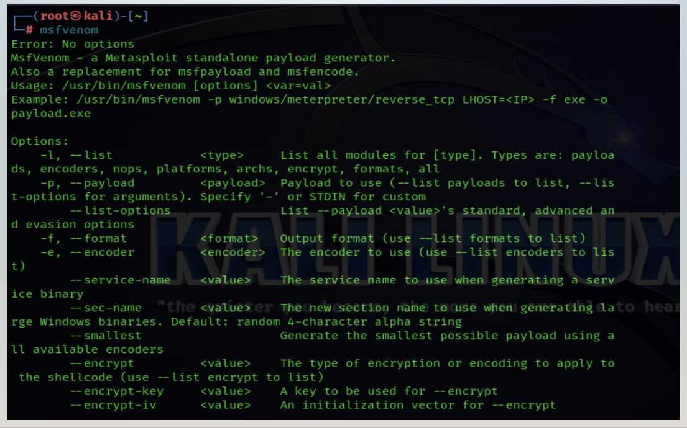
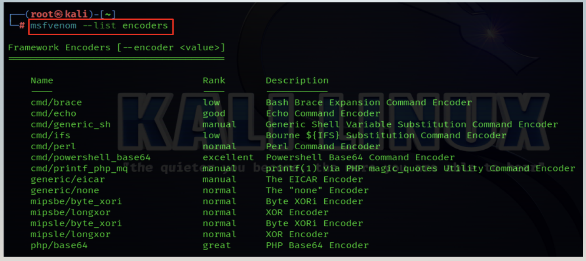
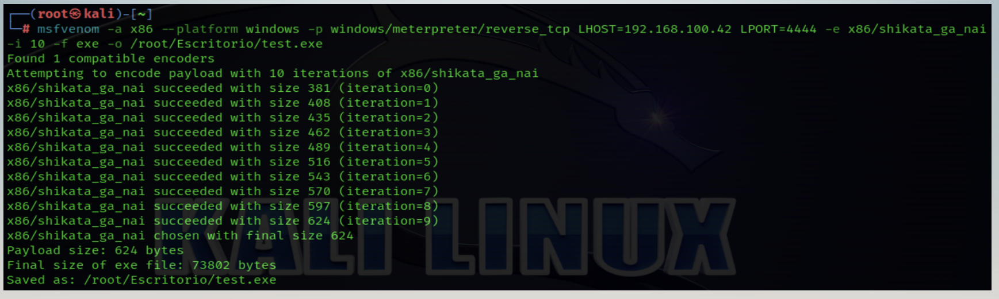

# MSF Venom Enoders
Se trata de una herramienta que tiene la capacidad de generar payloads para diversos sistemas operativos entre los que destacan:

* Windows
* Linux
* Android

La herramienta funciona sobre una línea de comandos (consola) en Kali Linux y otras distribuciones orientadas al hacking ético.

Dentro de msfvenom podemos listar las diferentes opciones que tenenmos disponibles para trabajar, en este caso haremos énfasis en los encoders y las iteraciones de los payloads.

Dentro de msfvenom podemos listar las diferentes opciones que tenenmos disponibles para trabajar, en este caso haremos énfasis en los encoders y las iteraciones de los payloads.

### ¿Qué son los encoders?
Son módulos que permiten realizar el empaquetamiento de un binario con la finalidad de tratar de evadir los programas antivirus.

### ¿Qué son las iteraciones?
Las iteraciones son las veces que se va a “envolver” un binario, con la intension de hacer bypass a determinado antivirus.

* Las iteraciones no garantiza saltar todos los antivirus
* No se recomienda abusar de las iteraciones

### Verificación del payload
Cuando se genera un payload se debe verificar en alguna plataforma de análisis en línea EXCEPTO VIRUS TOTAL!!!

La opción que se recomienda utilizar es:

* https://antiscan.me/

### Generacion de un payload de forma correcta
Veamos el procesos paso a paso para generar un payload

