# Ataques con ms-Office

### Acultar el Payload atras de una imagen

### Recoleccion del material
Hay muchas tecnicas que se pueden emplear para ocultar un payload atras de una imagen
* Winrar es la forma mas comun y sencilla de hacerla 

Los usuariuos son curiosos si se realizo un buen trabajo de ingenieria social, deberia hacer sin probelma que acceda a la imagen 

### Winrar
Se necesita:
* Compresor de archivos Winrar
* La imagen malisiosa
* ToYcon 

### ¿Qué es una macro?
Una macro nos ayuda a automatizar aquellas tareas que hacemos repetidamente. Una macro es una serie de instrucciones que son guardadas dentro de un archivo de Office para poder ser ejecutadas cuando lo necesitemos.

### Utilización de una macro
Generalmente las macros suelen utilizarse en Excel, sin embargo esta pueden se aplicadas para otros productos de la familia de Office

### ¿Qué es ps1 encode?
Se trata de una herramienta de línea de comandos de Linux que permite la creación de cargas útiles (payloads) de metasploit basadas en powershell.

### ¿Cómo obtener ps1 encode?
La herramienta esta a disposición en github y se pude acceder a ella mediante el siguiente enlace:

* https://github.com/CroweCybersecurity/ps1encode

### ¿Cómo trabaja ps1 encode?
La herramienta genera códigos de subrutina basados en visual basic los cuales pueden ser insertados posteriormente en documentos de office  bajo la generación de una macro. 

# Bindeo de payloads
### Recolección de materiales
Para poder ocultar un payload detrás de una imagen se pueden emplear muchas técnicas, sin embargo una de las más comunes por su sencillez es a través del uso de programa compresor de archivos “Winrar”

Veamos que es lo que debemos tener disponible para el procedimiento:

### Recolección de materiales
Las herramientas necesarias para realizar esta tarea son las siguientes:

* Compresor de archivos Winrar
* La imagen que será utilizada  como contenedor

### Datos a considerar 
Generalmente los usuarios suelen ser curiosos, por lo tanto si realizamos un buen trabajo de ingeniería social podremos llegar tener claros cuales son los gustos de cada posible victima.

### Contenedor del backdoor
**Procedimiento paso a paso**

Haciendo uso de la herramienta “toycon”  creamos un ícono, el cual nos será útil para engañar a la victima.

Considerando que ya está generado el payload ahora procedemos a trabajarlo con el compresor de archivos Winrar.

Este procedimiento lo realzamos en un equipo Windows dentro de nuestro laboratorio de pruebas.

Hacemos clic derecho sobre el payload y elegimos añadir al archivo

En la ventana debemos seleccionar respectivamente los siguientes parámetros de configuración:

* Establecer un nombre al archivo (nombre.jpg)
* Seleccionar método de compresión  la mejor
* En las opciones de la derecha  seleccionamos “crear un archivo autoejecutable”

Una vez configurados estos parámetros pulsamos sobre la ceja “avanzado” una vez dentro debemos configurar diversos parámetros.

Una vez que pulsamos sobre autoextraíble se presenta una ventana con diversas cejas en las cuales debemos configurar varios parámetros.

Veamos de manera detallada que parámetros debemos configurar:

### Verificación hexadecimal
Veamos el archivo que acabamos de crear en modo hexadecimal para comprobar que detrás de la imagen existe un archivo ejecutable.

Este archivo ejecutable está completamente oculto a los ojos de la victima, sin embargo se ejecuta y al atacante le otorga una shell reversa.

Veamos…

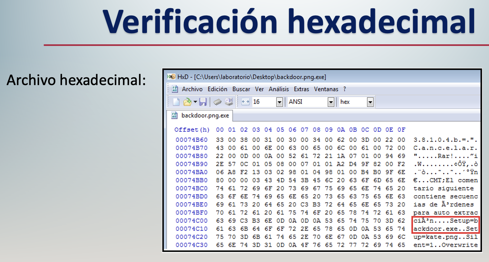

### Resultados obtenidos
Como se aprecia hay una imagen de nombre “kate.png” pero antes de la imagen existe un archivo de nombre “backdoor.exe”

Lo que nos deja ver que el archivo ejecutable está oculto en la fotografía, los contenedores pueden ser:

* Archivos en formato .jpg
* Archivos en formato .png

### Paso a paso
1. Generar el payload 
2. General el icono contenedor en ToYcon 
3. Winrar (Dentro de windows en el laboratorio de pruebas)

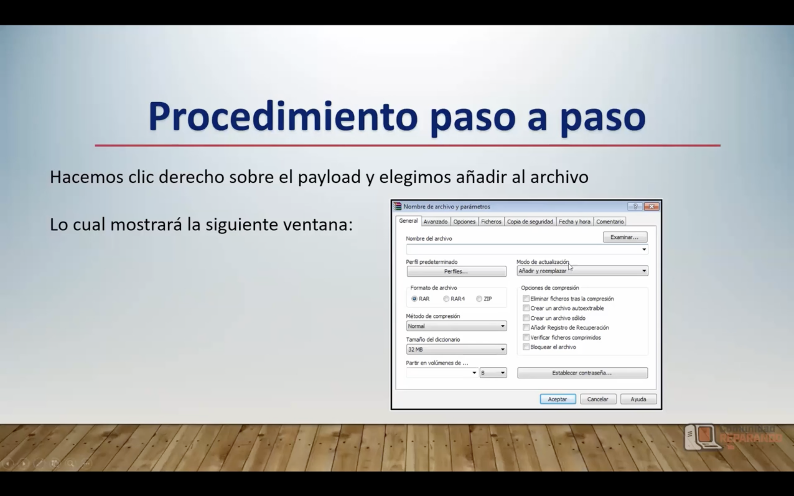
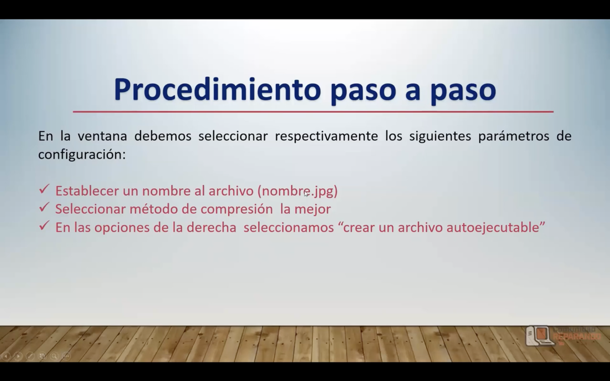
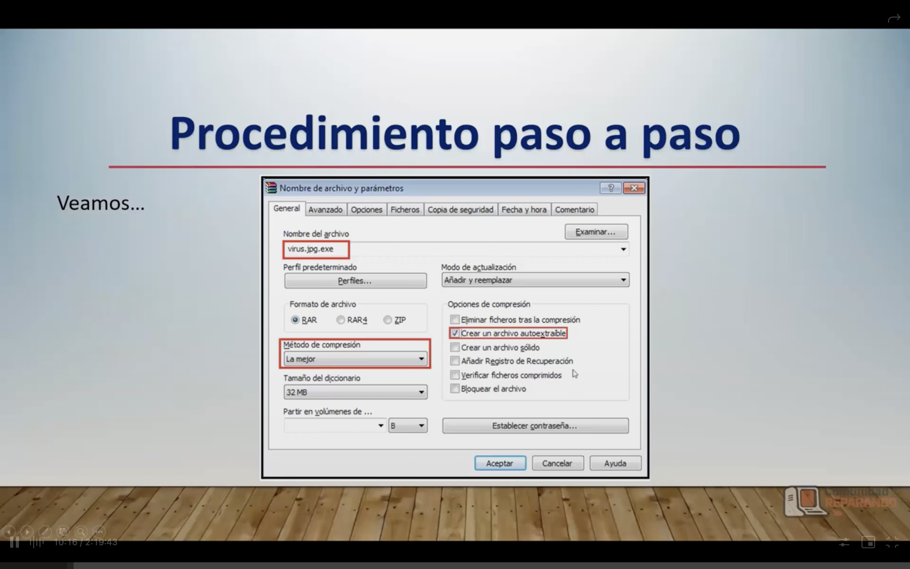
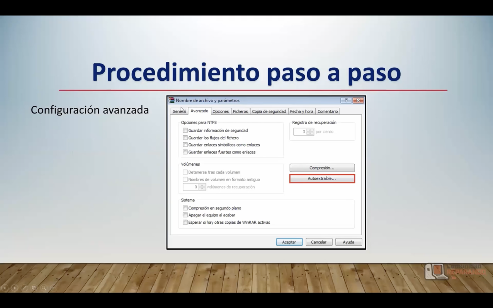
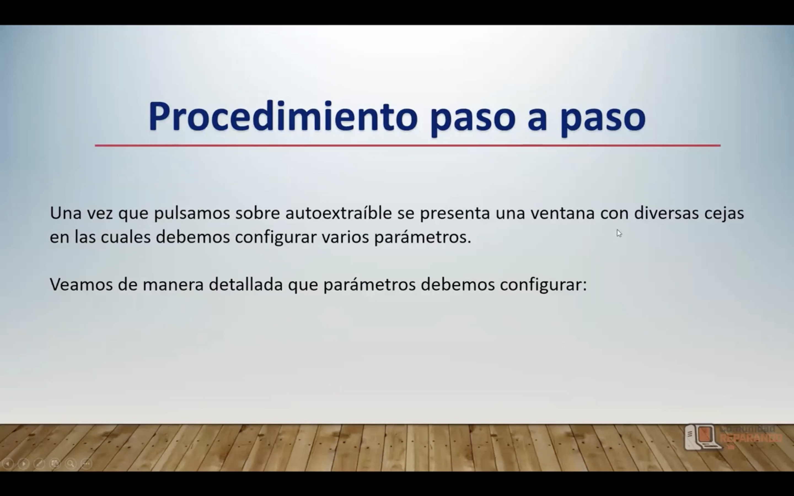
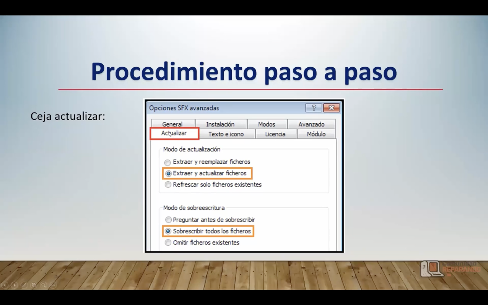
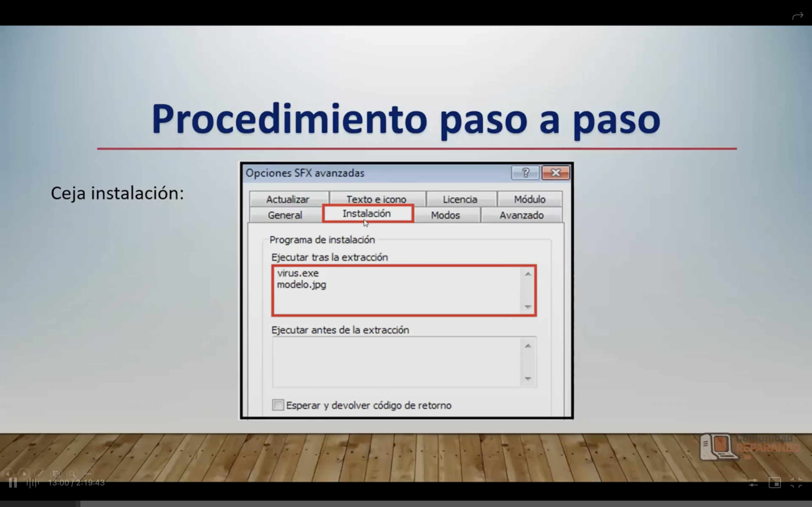
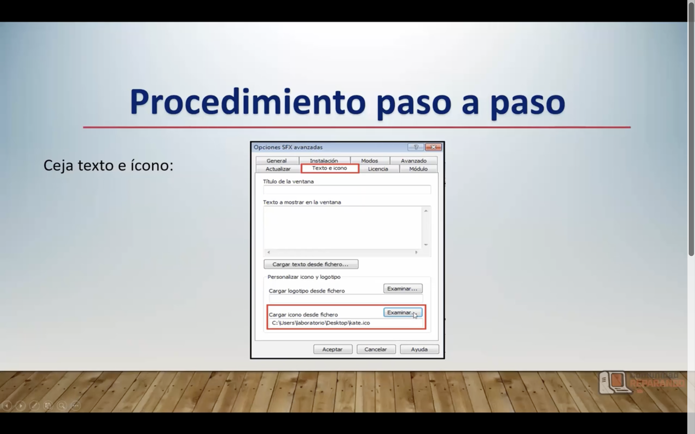
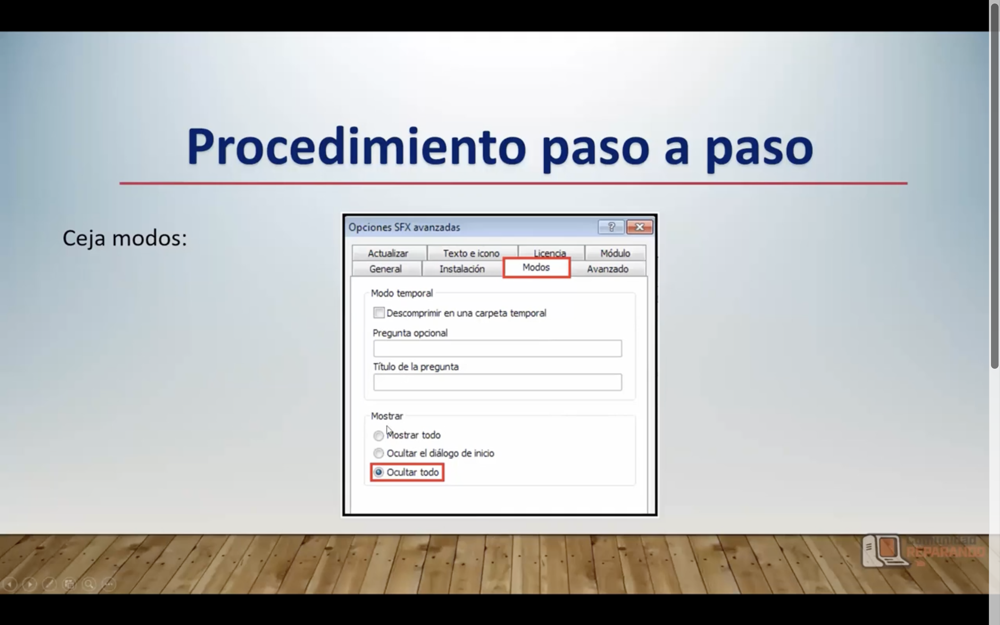
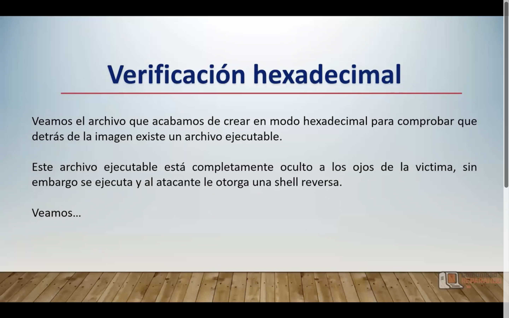

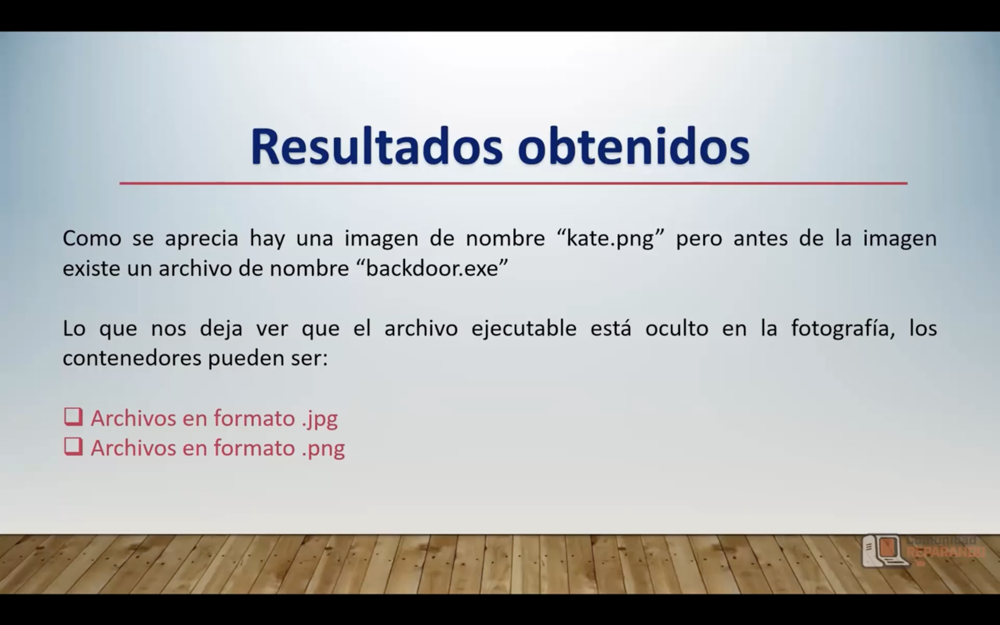

